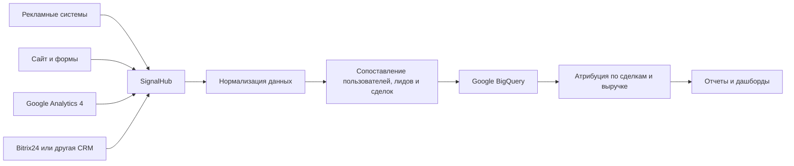
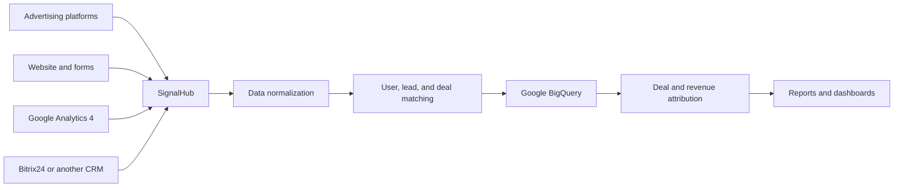

Понял. Нужна не презентация продукта, а сухое описание логики системы.

# SignalHub

SignalHub — система сбора и объединения маркетинговых данных из нескольких источников.

Система подключается к рекламным кабинетам, сайту, Google Analytics, CRM и другим сервисам через API, вебхуки или регулярную загрузку данных.

## Как работает

1. SignalHub получает данные о рекламных расходах, кампаниях, кликах и идентификаторах пользователей из Google Ads, Meta Ads и других рекламных систем.
2. Получает данные о действиях пользователей на сайте из Google Analytics 4 и других систем аналитики.
3. Получает из CRM данные о лидах, сделках, статусах, суммах продаж и фактической выручке.
4. Приводит данные из разных источников к единому формату.
5. Сопоставляет рекламные переходы, пользователей, лиды и сделки по доступным идентификаторам:

   * `gclid`
   * `fbclid`
   * `client_id`
   * `user_id`
   * номер телефона
   * email
   * CRM ID
   * UTM-метки
6. Сохраняет объединенные данные в Google BigQuery или другом хранилище.
7. Строит атрибуцию на основании фактически созданных и оплаченных сделок, а не только событий рекламных пикселей.



Основной источник результата для SignalHub — данные CRM:

* создан ли лид;
* создана ли сделка;
* на какой стадии находится сделка;
* была ли сделка успешно закрыта;
* какая выручка получена;
* какой рекламный источник привел эту сделку.

Рекламные пиксели и события используются как сигналы, но итоговая оценка эффективности строится по данным о сделках и выручке.

---

# SignalHub

SignalHub is a system for collecting and combining marketing data from multiple sources.

The system connects to advertising platforms, websites, Google Analytics, CRM systems, and other services through APIs, webhooks, or scheduled data imports.

## How it works

1. SignalHub retrieves advertising spend, campaign, click, and user identifier data from Google Ads, Meta Ads, and other advertising platforms.
2. It retrieves website activity data from Google Analytics 4 and other analytics systems.
3. It retrieves leads, deals, statuses, sales amounts, and actual revenue from the CRM.
4. It converts data from different systems into a common format.
5. It matches advertising clicks, users, leads, and deals using available identifiers:

   * `gclid`
   * `fbclid`
   * `client_id`
   * `user_id`
   * phone number
   * email
   * CRM ID
   * UTM parameters
6. It stores the combined data in Google BigQuery or another data warehouse.
7. It calculates attribution using actual CRM deals and revenue rather than relying only on advertising pixel events.



The CRM is the main source of business results for SignalHub:

* whether a lead was created;
* whether a deal was created;
* the current deal stage;
* whether the deal was successfully closed;
* the amount of revenue generated;
* the advertising source associated with the deal.

Advertising pixels and analytics events are treated as signals. Final performance evaluation is based on deals and actual revenue.

---

🚀 Deployed on [Cloudflare Pages](https://pages.cloudflare.com/)
📊 Engineered for clarity, speed, and scale.

## Development notes

- Все HTML-страницы должны содержать Google Analytics-тег сразу после открытия тега `<head>`:

  ```html
  <!-- Google tag (gtag.js) -->
  <script async src="https://www.googletagmanager.com/gtag/js?id=G-9W93MFG4YF"></script>
  <script>
  window.dataLayer = window.dataLayer || [];
  function gtag(){dataLayer.push(arguments);}
  gtag('js', new Date());

  gtag('config', 'G-9W93MFG4YF');
  </script>
  ```
